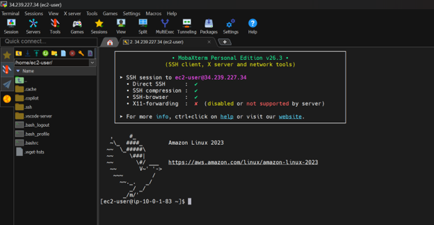
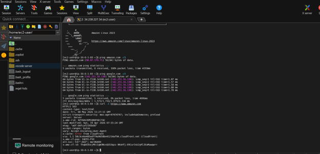

### Mục tiêu tuần 3:
- Tìm hiểu NAT Gateway và cơ chế kết nối Internet cho Private Subnet.
- Thực hành EC2 Instance Connect Endpoint (EICE).
- Nghiên cứu phương pháp kết nối bảo mật trong AWS.
- Tìm hiểu quy trình tối ưu hóa chi phí và dọn dẹp tài nguyên AWS.

### Các công việc cần triển khai trong tuần này:

| Thứ | Công việc                                                                                                                                    | Ngày bắt đầu | Ngày hoàn thành | Nguồn tài liệu                                                         |
| --- | -------------------------------------------------------------------------------------------------------------------------------------------- | ------------ | --------------- | ---------------------------------------------------------------------- |
| 2   | - Nghiên cứu lý thuyết NAT Gateway   - Tìm hiểu Internet access cho Private Subnet                                                        | 04/05/2026   | 04/05/2026      | [https://000003.awsstudygroup.com/](https://000003.awsstudygroup.com/) |
| 3   | - Tìm hiểu Route Table và cơ chế định tuyến trong VPC   - Nghiên cứu EC2 Instance Connect Endpoint (EICE)                                 | 05/05/2026   | 05/05/2026      | [https://000003.awsstudygroup.com/](https://000003.awsstudygroup.com/) |
| 4   | - Tìm hiểu Security Group cho EICE   - Nghiên cứu Troubleshooting SSH Connection                                                          | 06/05/2026   | 06/05/2026      | [https://000003.awsstudygroup.com/](https://000003.awsstudygroup.com/) |
| 5   | - Thực hành triển khai NAT Gateway và EICE   - Kiểm tra kết nối Internet từ EC2 Private   - Kết nối SSH vào EC2 Private từ AWS Console | 07/05/2026   | 07/05/2026      | [https://000003.awsstudygroup.com/](https://000003.awsstudygroup.com/) |
| 6   | - Nghiên cứu và đề xuất ý tưởng đề tài cá nhân   - Chuẩn bị nội dung thuyết trình đề tài đề xuất                                          | 08/05/2026   | 08/05/2026      | Internal Research                                                      |
| 7   | - Thảo luận và lựa chọn đề tài phù hợp cho dự án nhóm                                                                                        | 09/05/2026   | 09/05/2026      | Internal Meeting                                                       |

### Kết quả đạt được tuần 3:

| Thứ | Công việc                                       | Kết quả đạt được                                                                                                                                                                                                                                                                 |
| --- | ----------------------------------------------- | -------------------------------------------------------------------------------------------------------------------------------------------------------------------------------------------------------------------------------------------------------------------------------- |
| 2   | Nghiên cứu NAT Gateway                          | Hiểu cách hoạt động của NAT Gateway và cơ chế cấp quyền Internet cho Private Subnet thông qua Elastic IP và Route Table.                                                                                                                                                         |
| 3   | Nghiên cứu EC2 Instance Connect Endpoint (EICE) | Nắm được cơ chế hoạt động của EC2 Instance Connect Endpoint và phương thức kết nối bảo mật tới EC2 Private mà không cần Public IP hoặc Bastion Host.                                                                                                                             |
| 4   | Nghiên cứu Security Group và Troubleshooting    | Hiểu cách cấu hình Security Group cho EICE, xử lý lỗi SSH Connection và thực hiện Troubleshooting Network trong AWS Cloud.                                                                                                                                                       |
| 5   | Thực hành NAT Gateway và EICE                   | Thực hành thành công NAT Gateway, Route Table, Security Group và EC2 Instance Connect Endpoint. Kết nối thành công tới EC2 Private trực tiếp từ AWS Console. Thực hiện dọn dẹp tài nguyên ngay sau khi hoàn thành bài lab nhằm tránh phát sinh chi phí không cần thiết trên AWS. |
| 6   | Đề xuất ý tưởng đề tài cá nhân                  | Hoàn thành việc nghiên cứu và xây dựng đề xuất đề tài cá nhân dựa trên định hướng Cloud/AI của chương trình FCAJ.                                                                                                                                                                |
| 7   | Thảo luận lựa chọn đề tài                       | Tham gia thảo luận, đánh giá và lựa chọn đề tài phù hợp để triển khai cho dự án nhóm.                                                                                                                                                                                            |

---

### Hình ảnh minh chứng thực tế bài thực hành:

#### 1. Kết nối SSH vào máy chủ công cộng (EC2-Public) qua MobaXterm

Sử dụng client MobaXterm kết nối thành công qua SSH Session tới máy chủ có IP Public 34.239.227.34 trên nền tảng Amazon Linux 2023.

#### 2. Kiểm tra kết nối Internet và gọi thử dịch vụ trên máy chủ Public

Thực hiện thành công lệnh ping kiểm tra kết nối mạng diện rộng tới Google và sử dụng lệnh curl -I để kiểm tra phản hồi HTTP từ hệ thống Amazon.

#### 3. Phân quyền cặp khóa và thực hiện SSH nhảy cấp từ máy Public sang máy Private

Cấu hình phân quyền an toàn cho file key pair (chmod 400) và thực hiện SSH bảo mật từ dải IP của máy Public sang máy Private (10.0.2.157) thành công.

#### 4. Cấp phát địa chỉ IP tĩnh (Elastic IP) cho hệ thống NAT Gateway

Giao diện quản lý VPC cho thấy đã allocate thành công một địa chỉ Elastic IP cố định 32.194.27.77 đặt tên là EIP-NAT-AZ1a phục vụ hạ tầng mạng.

#### 5. Khởi tạo thành công NAT Gateway trên giao diện điều khiển AWS Console

Hệ thống mạng ghi nhận cổng dịch vụ NAT-Gateway-AZ1a đã được liên kết với dải IP tĩnh vừa tạo và chuyển sang trạng thái sẵn sàng hoạt động (Available).

#### 6. Thử nghiệm kết nối mạng một chiều thành công từ bên trong vùng kín (Private)

Máy chủ kín EC2-Private sau khi được định tuyến qua NAT Gateway đã có thể thực hiện lệnh ping 8.8.8.8 và nhận đầy đủ dữ liệu phản hồi từ Internet.

#### 7. Quản trị trực tiếp Terminal thông qua dịch vụ EC2 Instance Connect Endpoint (EICE)

Truy cập bảo mật thành công vào thẳng giao diện dòng lệnh của máy chủ Private trực tiếp từ trình duyệt Web thông qua cổng Endpoint được cấu hình sẵn.

