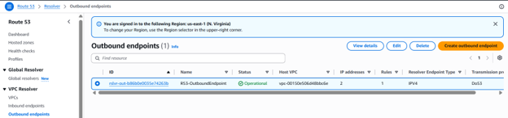
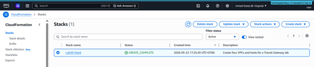
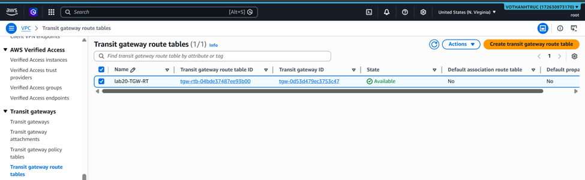
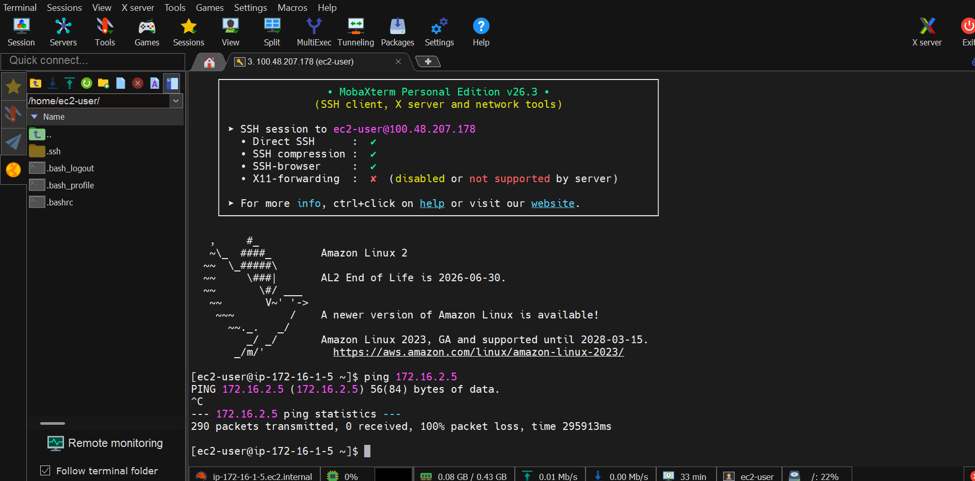
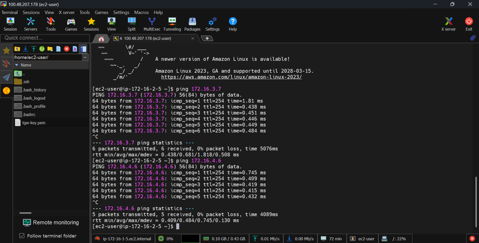
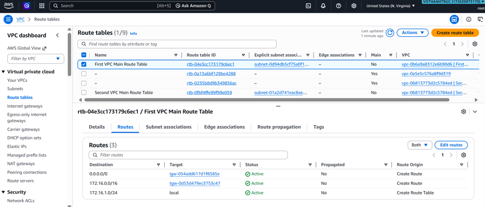
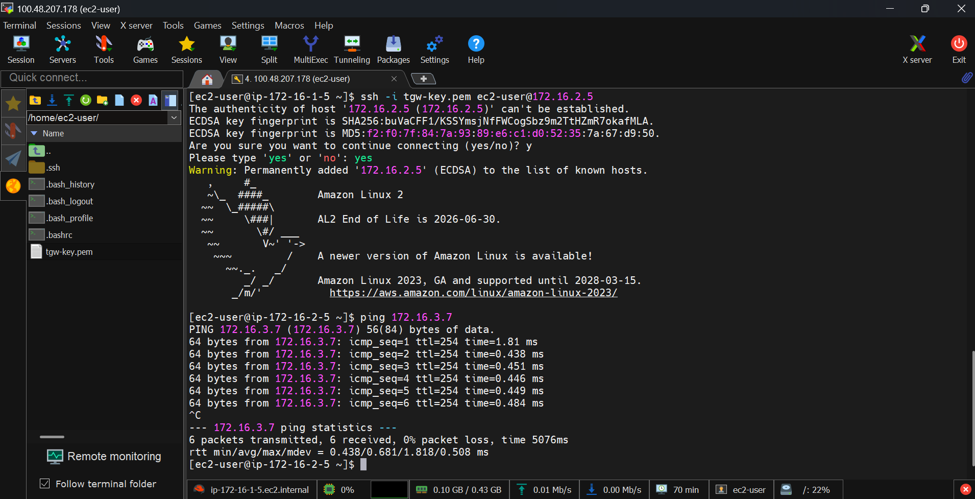

### Week 4 Objectives:

- Learn how Hybrid DNS works in AWS Cloud.
- Practice Amazon Route 53 Resolver for hybrid DNS resolution.
- Configure VPC Peering to enable secure communication between VPCs.
- Research AWS Transit Gateway and the Hub-and-Spoke networking model.

### Tasks to be carried out this week:

| Day | Task | Start Date | Completion Date | Reference Material |
| --- | --- | --- | --- | --- |
| 2 | - Study the Hybrid DNS architecture and DNS resolution mechanism in AWS   - Learn the VPC Peering architecture and communication between VPCs | 05/11/2026 | 05/11/2026 | First Cloud AI Journey Course |
| 3 | - Practice Lab 10: Set up Hybrid DNS using Amazon Route 53 Resolver   - Configure Resolver Endpoints and Resolver Rules | 05/12/2026 | 05/12/2026 | First Cloud AI Journey Course |
| 4 | - Practice Lab 19: Configure VPC Peering   - Configure Route Tables and verify Cross-VPC Communication | 05/13/2026 | 05/13/2026 | First Cloud AI Journey Course |
| 5 | - Research AWS Transit Gateway   - Learn the Hub-and-Spoke architecture for centralized networking | 05/14/2026 | 05/14/2026 | First Cloud AI Journey Course |
| 6 | - Practice Lab 20: Configure AWS Transit Gateway   - Configure routing and connectivity between multiple VPCs | 05/15/2026 | 05/15/2026 | First Cloud AI Journey Course |

### Week 4 Achievements:

| Day | Task | Achievement |
| --- | --- | --- |
| 2 | Research Hybrid DNS and VPC Peering | Gained an understanding of Hybrid DNS architecture in AWS Cloud, DNS resolution across hybrid environments, and the VPC Peering networking model. |
| 3 | Deploy Route 53 Resolver | Successfully configured Amazon Route 53 Resolver, Resolver Endpoints, and Resolver Rules, and verified DNS resolution between connected environments. |
| 4 | Configure VPC Peering | Successfully established VPC Peering connections, updated Route Tables, and verified secure communication between VPCs. |
| 5 | Research AWS Transit Gateway | Understood the working principles of AWS Transit Gateway and the Hub-and-Spoke networking architecture for centralized VPC connectivity. |
| 6 | Deploy AWS Transit Gateway | Successfully configured AWS Transit Gateway, established routing between multiple VPCs, and gained practical knowledge of Route Tables, Network ACLs, Security Groups, and Hybrid Networking. |
---

### Practical Evidence Images:

#### 1. Initializing the Windows Server instance (RDGW-Server)

The EC2 management console verifies that the RDGW-Server instance running the Windows platform has been successfully initialized and is in the Running state, ready to serve as a routing test environment.

#### 2. Configuring network security (Security Groups)

Successfully set up and modified Inbound Rules for the RDGW-SG security group, allowing the necessary traffic flows for DNS testing and server control.

#### 3. Creating an Inbound Endpoint (Route 53 Resolver Inbound Endpoint)

The system reports the successful configuration of the Inbound endpoint (R53-InboundEndpoint) on Route 53, allowing the On-Premises environment to resolve domain names hosted on the AWS infrastructure.

#### 4. Creating an Outbound Endpoint (Route 53 Resolver Outbound Endpoint)

Initialized the Operational status for the Outbound endpoint (R53-OutboundEndpoint), acting as a bridge to forward DNS query packets from AWS to the internal network.

#### 5. Setting up forwarding rules (Resolver Rules)

The DNS routing rule table records that the ForwardToOnPremAD rule has been completely created. This rule is responsible for catching queries to the corp.internal domain and forwarding them through the Outbound endpoint.

#### 6. Testing Hybrid DNS domain resolution using nslookup

Accessed the Windows server (RDGW-Server) and executed the nslookup command. The results show that the system successfully resolved the internal domain corp.internal to the IP address 10.0.4.201 via the intermediary DNS server 10.0.0.2.

### 1. Practice Lab 20

#### 1. Provision the Lab 20 Network Infrastructure Using CloudFormation

The CloudFormation stack **Lab20-Stack** was successfully deployed, automatically provisioning four VPCs and their corresponding EC2 instances required for the AWS Transit Gateway lab.

#### 2. Create the AWS Transit Gateway

The AWS Transit Gateway named **lab20-tgw** was successfully created and reached the **Available** state, serving as the central network hub for the architecture.

#### 3. Configure Transit Gateway Attachments

Successfully attached all four VPCs to the Transit Gateway, forming a centralized **Hub-and-Spoke** network topology.

#### 4. Configure the Transit Gateway Route Table – Associations

The Transit Gateway Route Table shows that all VPC attachments have been successfully associated and are ready to receive routing configurations.

#### 5. Configure the Transit Gateway Route Table – Propagations

Successfully enabled **Route Propagation**, allowing the Transit Gateway to automatically learn and advertise the CIDR blocks of the four connected VPCs.

#### 6. Update the Route Tables in Each VPC

The VPC Route Tables were updated to route traffic destined for the **172.16.0.0/16** network through the Transit Gateway instead of the Internet Gateway.

#### 7. Connect to the Bastion Host (VPC 1)

Successfully connected to the EC2 instance in **VPC 1** using **MobaXterm** (Public IP: **100.48.207.178**), which acts as the Bastion Host for network connectivity testing.

#### 8. Verify Internet Connectivity from the Bastion Host

Executed **ping amazon.com** and **ping google.com** successfully from the Bastion Host to verify stable outbound Internet connectivity before testing inter-VPC communication.

#### 9. Test Connectivity to VPC 2

Executed the **ping 172.16.2.5** command from the Bastion Host in **VPC 1**. Although the ping request resulted in **100% packet loss** because ICMP traffic was not allowed by the Security Group, the routing configuration through the Transit Gateway was successfully established.

#### 10. SSH to the EC2 Instance in VPC 2 and Test Connectivity to VPC 3

Using the **tgw-key.pem** private key, successfully established an SSH connection from the Bastion Host in **VPC 1** to the EC2 instance in **VPC 2** (Private IP: **172.16.2.5**). From there, successfully verified connectivity to **VPC 3** by pinging **172.16.3.7**.

#### 11. Verify End-to-End Connectivity with VPC 4

Completed the Transit Gateway connectivity validation by successfully reaching the EC2 instance in **VPC 4** (**172.16.4.6**). The results confirmed that all four VPCs were securely interconnected through the AWS Transit Gateway.

