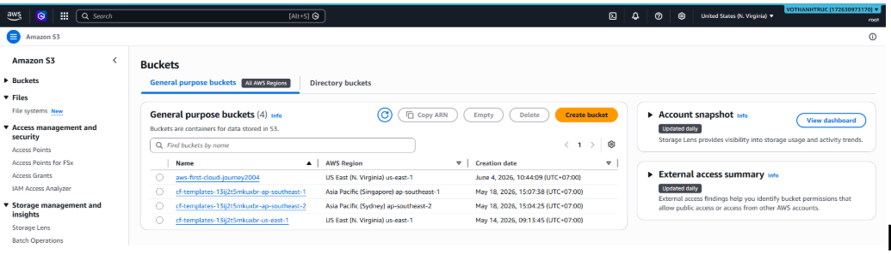
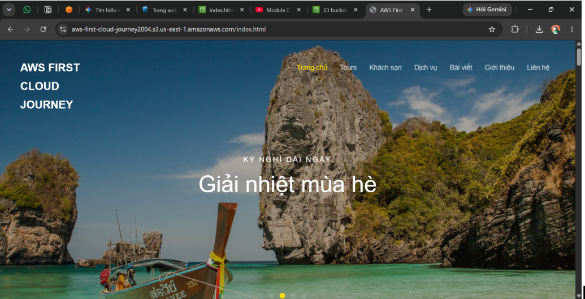
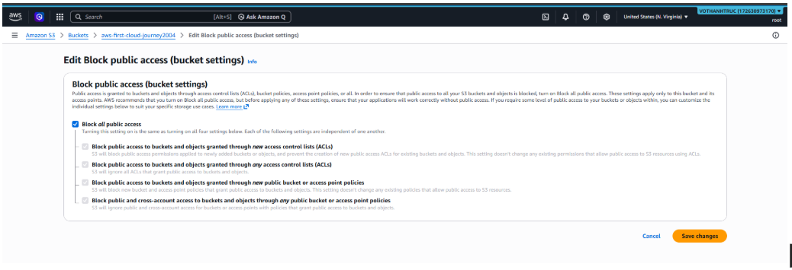
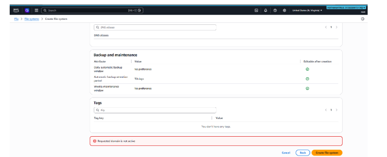
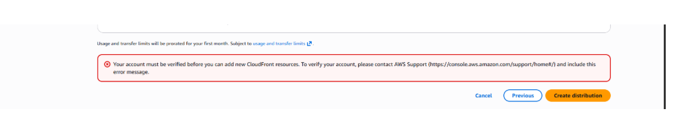

### Mục tiêu tuần 6:

- Tổng hợp kiến thức đã học từ các hoạt động cộng đồng AWS First Cloud AI Journey.
- Tìm hiểu các tính năng nâng cao của Amazon S3.
- Thực hành triển khai Static Website Hosting và Amazon CloudFront.
- Nghiên cứu các giải pháp lưu trữ dữ liệu trên AWS.
- Tìm hiểu các chiến lược Disaster Recovery và bảo vệ dữ liệu trên nền tảng Cloud.

### Các công việc cần triển khai trong tuần này:

| Thứ | Công việc | Ngày bắt đầu | Ngày hoàn thành | Nguồn tài liệu |
| --- | --- | --- | --- | --- |
| 2 | - Tổng hợp kiến thức đã học từ AWS First Cloud AI Journey Community Day   - Viết bài thu hoạch chia sẻ kiến thức và kinh nghiệm học tập | 25/05/2026 | 25/05/2026 | AWS First Cloud AI Journey Community Day |
| 3 | - Nghiên cứu Amazon S3 Advanced Features   - Tìm hiểu Static Website Hosting, Versioning và Cross-Region Replication | 26/05/2026 | 26/05/2026 | https://000057.awsstudygroup.com/ |
| 4 | - Thực hành Lab 57: Amazon S3 Advanced Features   - Triển khai Static Website Hosting   - Cấu hình CloudFront, Versioning và Cross-Region Replication | 27/05/2026 | 27/05/2026 | https://000057.awsstudygroup.com/ |
| 5 | - Nghiên cứu Module 04   - Tìm hiểu S3 Storage Classes, Lifecycle Management, Storage Gateway và AWS Snow Family | 28/05/2026 | 28/05/2026 | Module 04 |
| 6 | - Nghiên cứu Disaster Recovery trên AWS   - Tìm hiểu RTO, RPO và các chiến lược Backup & Restore, Pilot Light, Warm Standby, Multi-Site    | 29/05/2026 | 29/05/2026 | AWS Documentation |

### Kết quả đạt được tuần 6:

| Thứ | Công việc | Kết quả đạt được |
| --- | --- | --- |
| 2 | Tổng hợp kiến thức Community Day | Tổng hợp những kiến thức và kinh nghiệm thu được từ AWS First Cloud AI Journey Community Day, đồng thời hoàn thành bài thu hoạch nhằm củng cố các kiến thức đã học về AWS Cloud và AI. |
| 3 | Nghiên cứu Amazon S3 Advanced Features | Hiểu cơ chế hoạt động của Static Website Hosting, Versioning và Cross-Region Replication trong Amazon S3, đồng thời nắm được các trường hợp sử dụng của từng tính năng. |
| 4 | Thực hành Lab 57 | Triển khai thành công Static Website Hosting và Versioning trên Amazon S3. Việc cấu hình Amazon CloudFront chưa thể hoàn thành do tài khoản AWS Starter/Educate chưa được kích hoạt đầy đủ quyền tạo CDN. Nhóm đã ghi nhận vấn đề và gửi yêu cầu hỗ trợ để tiếp tục triển khai khi tài khoản được cấp quyền. |
| 5 | Nghiên cứu Module 04 | Hiểu sự khác biệt giữa các S3 Storage Classes, Lifecycle Management, Storage Gateway và AWS Snow Family; biết cách lựa chọn giải pháp lưu trữ phù hợp với từng nhu cầu sử dụng. |
| 6 | Nghiên cứu Disaster Recovery | Nắm được các chỉ số RTO và RPO, hiểu các mô hình Disaster Recovery như Backup & Restore, Pilot Light, Warm Standby và Multi-Site, đồng thời thực hiện dọn dẹp toàn bộ tài nguyên sau khi hoàn thành bài Lab nhằm tránh phát sinh chi phí. |AWS.                                          |

---

### Làm bài lab 57

