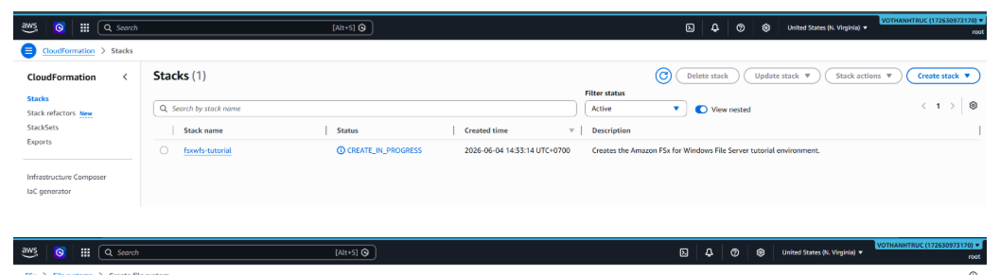
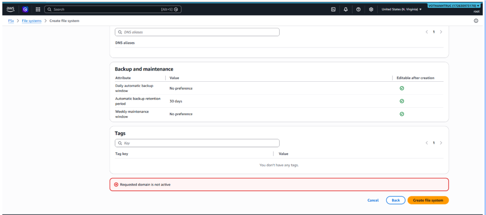

### Week 7 Objectives:

- Practice deploying Amazon FSx for Windows File Server.
- Learn the AWS Shared Responsibility Model.
- Study AWS identity and access management services.
- Learn AWS security and data encryption solutions.

### Tasks to be carried out this week:

| Day | Task | Start Date | Completion Date | Reference Material |
| --- | --- | --- | --- | --- |
| 2 | - Practice Lab 25: Amazon FSx for Windows File Server   - Deploy a Multi-AZ (SSD/HDD) file system   - Configure SMB File Shares and integrate Microsoft Active Directory   - Learn Storage Quotas, User Sessions, and Open Files | 06/01/2026 | 06/01/2026 | https://000025.awsstudygroup.com/ |
| 3 | - Study the AWS Shared Responsibility Model   - Learn AWS IAM, IAM Policies, and IAM Roles   - Study the Principle of Least Privilege and AWS STS | 06/02/2026 | 06/02/2026 | AWS Skill Builder / AWS Documentation |
| 4 | - Study AWS Organizations and AWS Identity Center (SSO)   - Learn Amazon Cognito, AWS KMS, and AWS Security Hub | 06/03/2026 | 06/03/2026 | AWS Skill Builder / AWS Documentation |
| 5 | - | 06/04/2026 | 06/04/2026 | - |
| 6 | - | 06/05/2026 | 06/05/2026 | - |

### Week 7 Achievements:

| Day | Task | Achievement |
| --- | --- | --- |
| 2 | Practice Lab 25 | Studied the deployment process of Amazon FSx for Windows File Server, including Multi-AZ File Systems, SMB File Shares, Microsoft Active Directory integration, Storage Quotas, and User Sessions. However, the lab could not be fully completed because the AWS Starter/Educate account did not have sufficient permissions to provision Amazon FSx resources. The issue was documented and a support request was submitted for further assistance. |
| 3 | Study AWS Identity and Access Management | Developed a solid understanding of the AWS Shared Responsibility Model and learned how AWS IAM, IAM Policies, IAM Roles, and AWS STS are used to implement secure access control based on the Principle of Least Privilege. |
| 4 | Study AWS Security Services | Gained knowledge of AWS Organizations, AWS Identity Center (SSO), Amazon Cognito, AWS KMS, and AWS Security Hub, and understood their roles in identity management, access control, and cloud security. |
| 5 | - | No scheduled activities for this day. |
| 6 | - | No scheduled activities for this day. |

### -Practice Lab 25

