### Mục tiêu tuần 8:

- Thực hành các giải pháp giám sát và bảo mật trên AWS.
- Tìm hiểu cơ chế phân quyền và bảo mật cho AWS Lambda.
- Nghiên cứu phương pháp quản lý tài nguyên bằng Tags và Resource Groups.
- Tìm hiểu hệ sinh thái cơ sở dữ liệu trên nền tảng AWS.
- Nâng cao kiến thức về quản trị dữ liệu và các dịch vụ cơ sở dữ liệu của AWS.

### Các công việc cần triển khai trong tuần này:

| Thứ | Công việc | Ngày bắt đầu | Ngày hoàn thành | Nguồn tài liệu |
| --- | --- | ------------ | --------------- | -------------- |
| 2 | - Thực hành Lab 18: AWS Security Hub   - Kích hoạt Security Hub và đánh giá cấu hình bảo mật hệ thống   - Phân tích Security Findings và AWS Security Best Practices | 08/06/2026 | 08/06/2026 | https://cloudjourney.awsstudygroup.com/ |
| 3 | - Thực hành Lab 22: Security Group và IAM Role cho AWS Lambda   - Cấu hình IAM Role theo Principle of Least Privilege   - Kiểm thử Lambda và xác minh CloudWatch Logs | 09/06/2026 | 09/06/2026 | https://cloudjourney.awsstudygroup.com/ |
| 4 | - Thực hành Lab 27: Resource Tagging và Resource Groups   - Quản lý tài nguyên bằng Tags, AWS CLI và Resource Groups   - Dọn dẹp tài nguyên sau khi hoàn thành Lab | 10/06/2026 | 10/06/2026 | https://cloudjourney.awsstudygroup.com/ |
| 5 | - Nghiên cứu Module 06 Database   - Tìm hiểu Amazon RDS, Amazon Aurora, Amazon Redshift và Amazon ElastiCache   - Nghiên cứu các khái niệm OLTP, OLAP, Primary Key, Foreign Key và Index | 11/06/2026 | 11/06/2026 | https://cloudjourney.awsstudygroup.com/ |
| 6 | - Tổng hợp kiến thức Module 05 và Module 06   - Ôn tập các dịch vụ bảo mật, quản lý tài nguyên và cơ sở dữ liệu trên AWS   - Hoàn thiện tài liệu thực hành tuần 8 | 12/06/2026 | 12/06/2026 | https://cloudjourney.awsstudygroup.com/ |

### Kết quả đạt được tuần 8:

| Thứ | Công việc | Kết quả đạt được |
| --- | --------- | ---------------- |
| 2 | Thực hành AWS Security Hub | Kích hoạt thành công AWS Security Hub, phân tích các Security Findings và hiểu cách áp dụng AWS Security Best Practices để đánh giá mức độ an toàn của hệ thống. |
| 3 | Bảo mật AWS Lambda | Hiểu cơ chế phân quyền cho AWS Lambda bằng IAM Role, áp dụng Principle of Least Privilege và cấu hình Security Group phù hợp để bảo vệ môi trường Serverless. |
| 4 | Quản lý tài nguyên AWS | Thực hành thành công Resource Tagging, Resource Groups và AWS CLI để tổ chức, tìm kiếm và quản lý tài nguyên hiệu quả; hoàn thành việc dọn dẹp tài nguyên sau Lab. |
| 5 | Nghiên cứu hệ sinh thái Database | Nắm được sự khác biệt giữa Amazon RDS, Aurora, Redshift và ElastiCache; hiểu các mô hình OLTP, OLAP cùng các khái niệm Primary Key, Foreign Key và Index. |
| 6 | Tổng hợp kiến thức tuần 8 | Củng cố kiến thức về bảo mật, quản lý tài nguyên và cơ sở dữ liệu trên AWS; hoàn thiện báo cáo thực hành và chuẩn bị kiến thức cho các Module tiếp theo. |

---

### Làm các bài lab:

#### Lab18

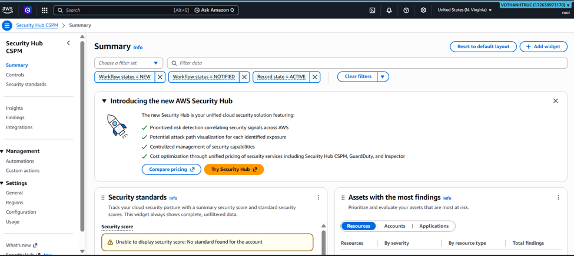
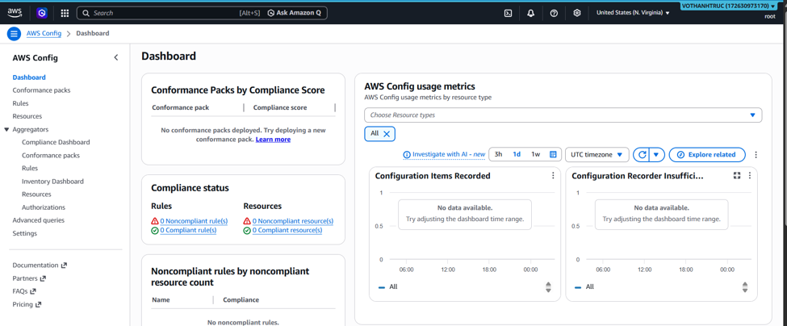

#### Lab22

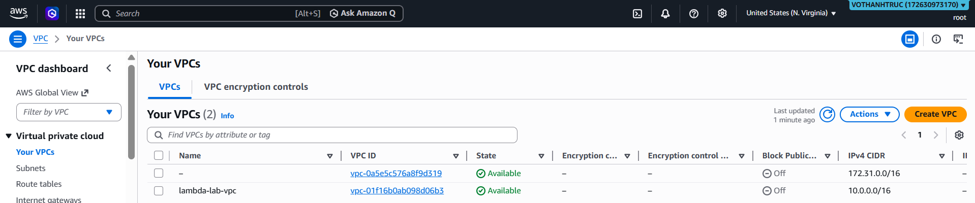

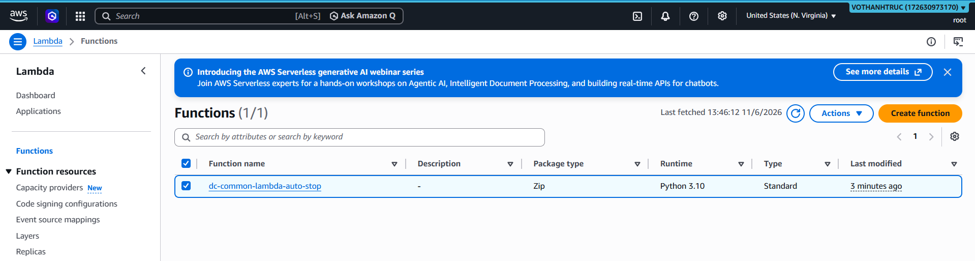
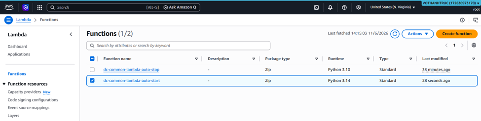
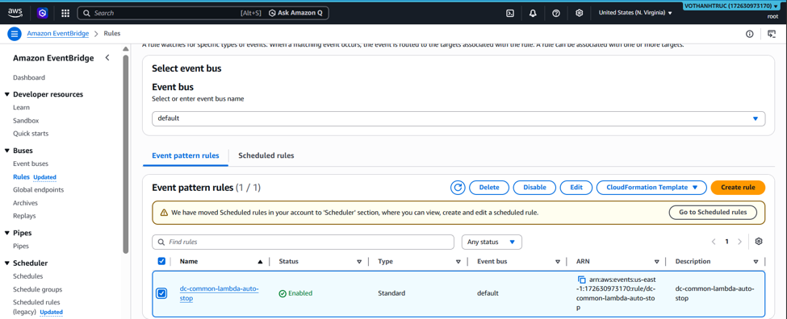

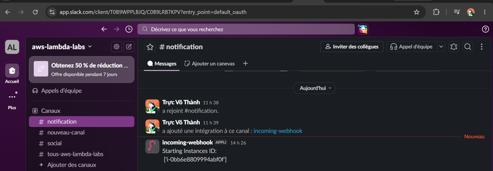
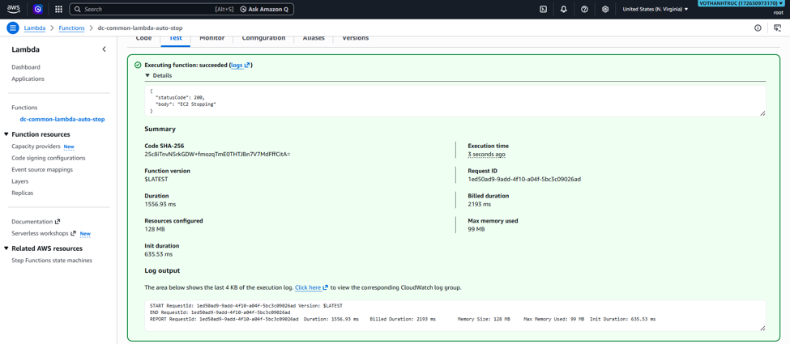
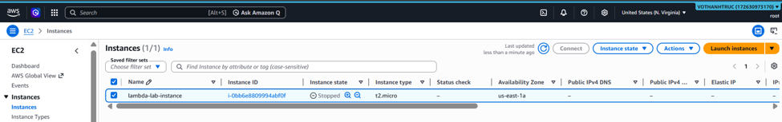
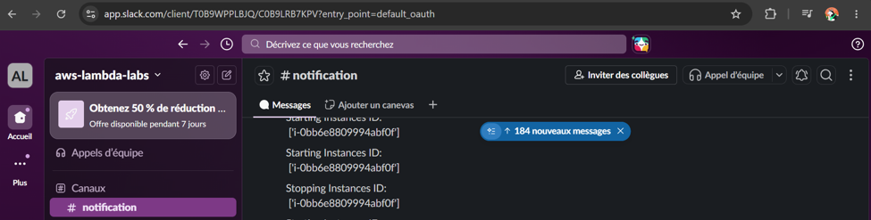

#### Lab27

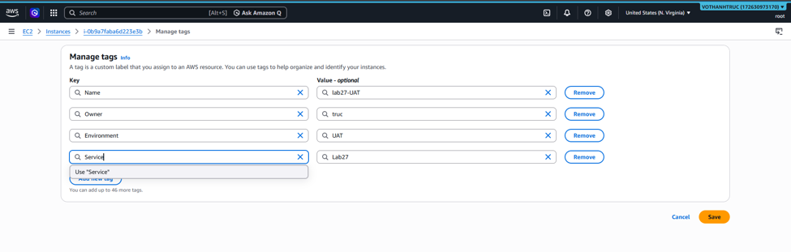
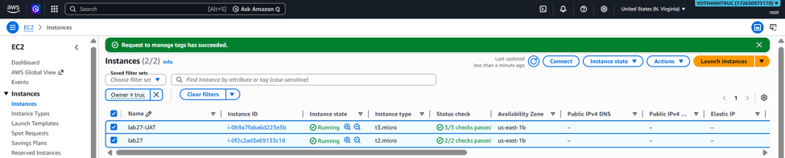

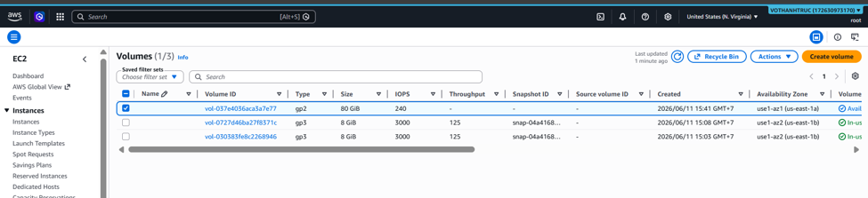

