### Week 9 Objectives:

* Learn Machine Learning and Artificial Intelligence services on AWS.
* Practice deploying Machine Learning models using Amazon SageMaker.
* Explore AI services including Amazon Textract, Amazon Rekognition, Amazon Comprehend, and Amazon Bedrock.
* Study how to integrate AI services into Serverless application architectures.
* Consolidate knowledge for applying AI services to the Serverless Intelligent Document Processing (IDP) System project.

### Week 9 Tasks

| Day   | Task                                                                                                                                                                                                                            | Start Date | Completion Date | Reference Material                                                                 |
| ----- | ------------------------------------------------------------------------------------------------------------------------------------------------------------------------------------------------------------------------------- | ---------- | --------------- | ---------------------------------------------------------------------------------- |
| **2** | - Study Amazon ECS fundamentals and container architecture. - Learn about Docker, Task Definition, Cluster, and Service in Amazon ECS.                                                                                       | 15/06/2026 | 15/06/2026      | [https://cloudjourney.awsstudygroup.com/](https://cloudjourney.awsstudygroup.com/) |
| **3** | - Practice **Lab 31: Deploying Applications with Amazon ECS**. - Create an ECS Cluster and deploy a containerized application. - Verify service availability and **clean up all AWS resources after completing the lab**. | 16/06/2026 | 16/06/2026      | [https://cloudjourney.awsstudygroup.com/](https://cloudjourney.awsstudygroup.com/) |
| **4** | - Study AWS serverless container services. - Learn Amazon ECR, AWS Fargate, ECS Service Auto Scaling, and Application Load Balancer integration.                                                                             | 17/06/2026 | 17/06/2026      | [https://cloudjourney.awsstudygroup.com/](https://cloudjourney.awsstudygroup.com/) |
| **5** | - Review Amazon ECS architecture and deployment workflow. - Compare Amazon ECS with AWS Lambda and Amazon EKS for different application scenarios.                                                                           | 18/06/2026 | 18/06/2026      | [https://cloudjourney.awsstudygroup.com/](https://cloudjourney.awsstudygroup.com/) |
| **6** | - Write the **Week 9 Worklog**. - Review all completed labs and consolidate knowledge gained throughout the week.                                                                                                            | 19/06/2026 | 19/06/2026      | Self-study                                                                         |

### Week 9 Achievements

| Day   | Activity                        | Achievement                                                                                                                                                                               |
| ----- | ------------------------------- | ----------------------------------------------------------------------------------------------------------------------------------------------------------------------------------------- |
| **2** | Studied Amazon ECS Fundamentals | Understood the architecture of Amazon ECS, container concepts, ECS Cluster, Task Definition, Service, and Docker-based application deployment.                                            |
| **3** | Completed Lab 31                | Successfully deployed a containerized application on Amazon ECS, verified service accessibility, and cleaned up all AWS resources after completing the lab to avoid unnecessary charges.  |
| **4** | Studied Advanced ECS Services   | Gained knowledge of Amazon ECR, AWS Fargate, ECS Service Auto Scaling, and Application Load Balancer integration for scalable containerized applications.                                 |
| **5** | Reviewed ECS Architecture       | Compared Amazon ECS, AWS Lambda, and Amazon EKS, and understood appropriate use cases for each compute service in AWS.                                                                    |
| **6** | Weekly Review & Documentation   | Completed the Week 9 worklog, reviewed all completed labs, summarized key concepts, and consolidated practical knowledge of Amazon ECS and container-based application deployment on AWS. |

#### Lab28

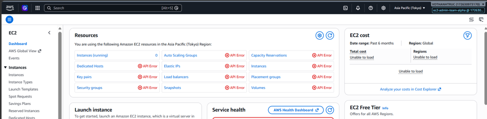
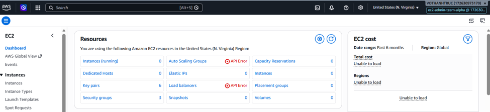

#### Lab30

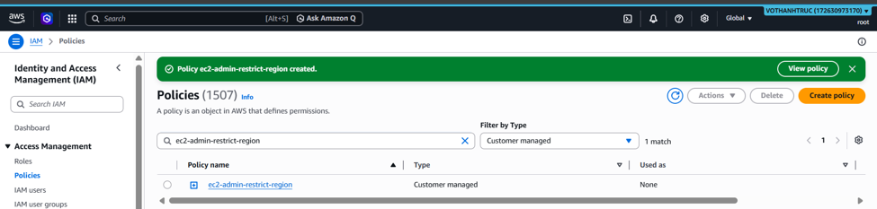

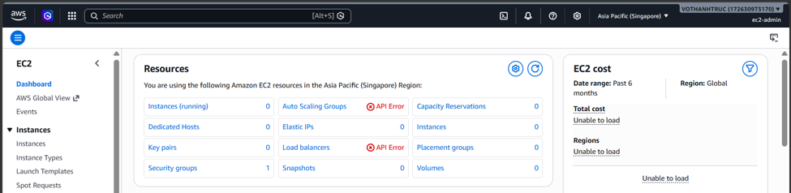
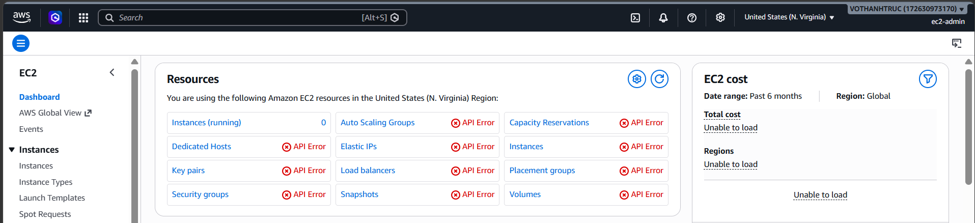

#### Lab33
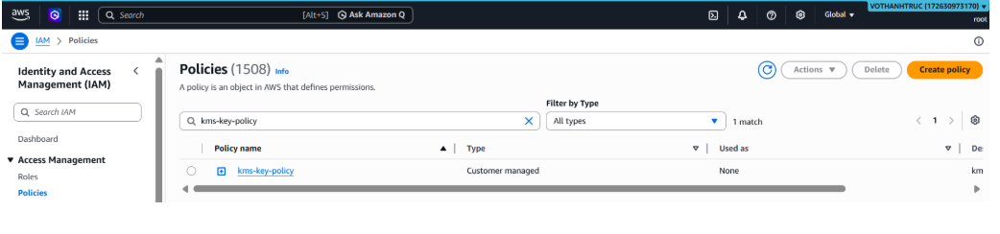
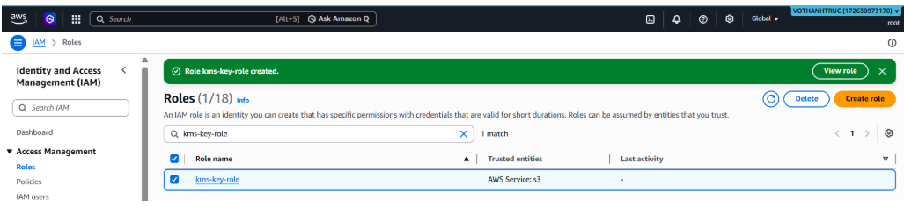
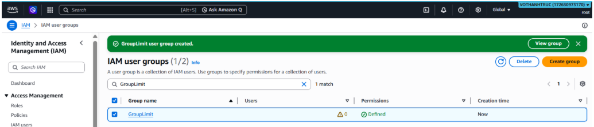
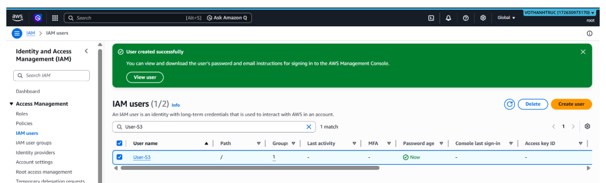
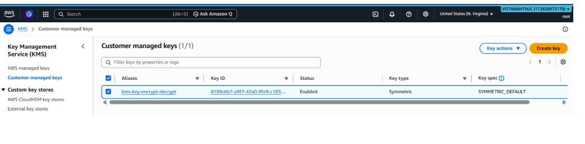
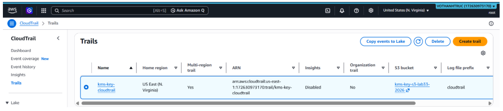