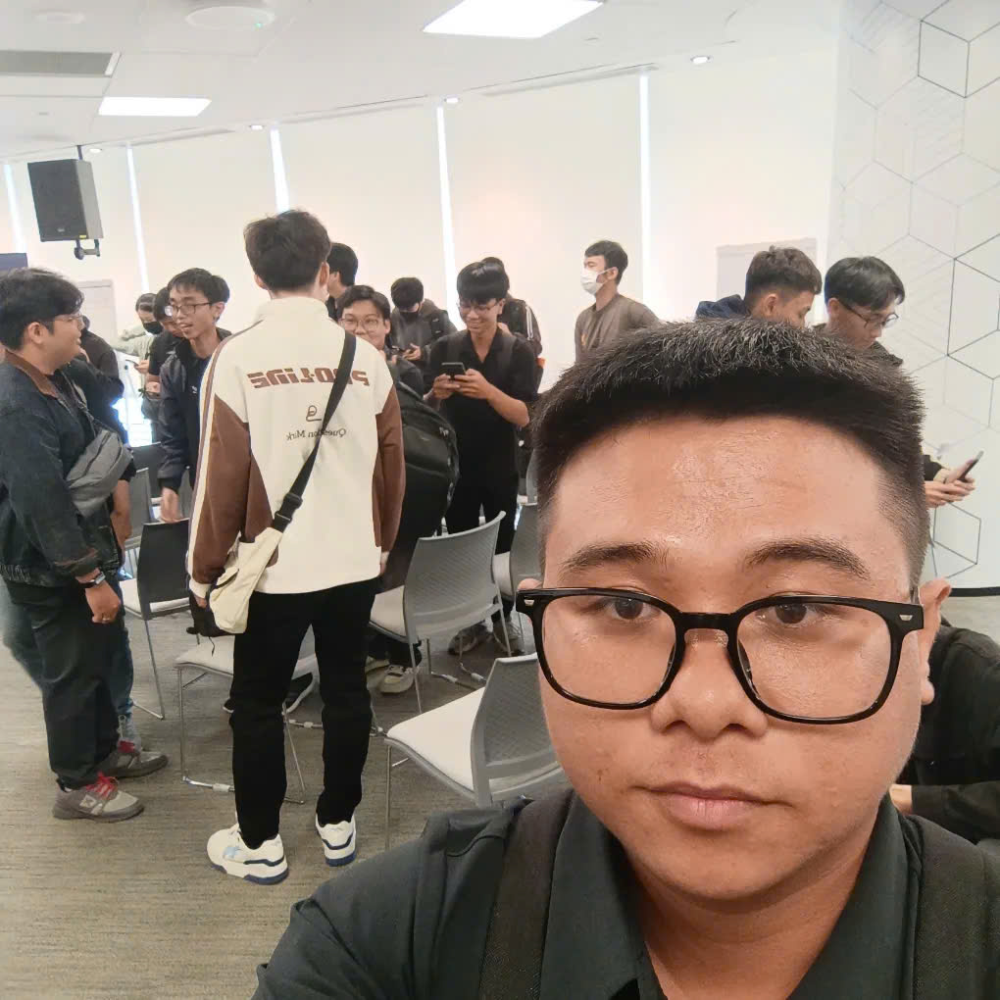
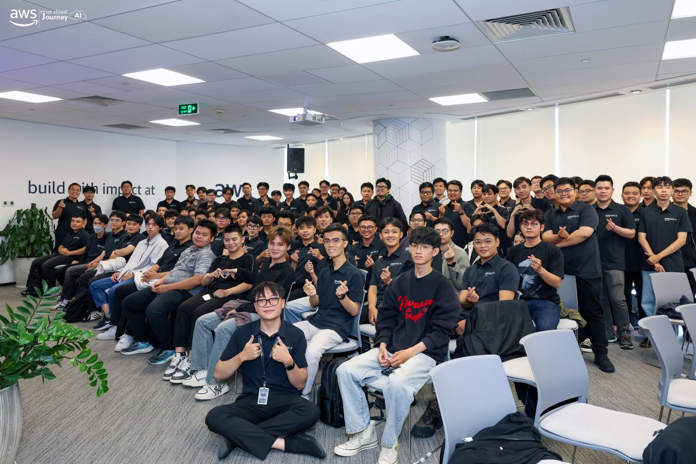

# Summary Report: “AWS First Cloud AI Journey Community Day”

### Event Objectives

- **Explore advanced AI theory and operations:** Understand the mathematical and infrastructure foundations behind Large Language Models (LLMs), context handling, enterprise-level multi-agent systems, and Agentic AI assistant tools.
- **Optimize cloud infrastructure:** Learn practical approaches to cost optimization, system security, and performance improvement from the edge layer to the origin server.
- **Experience hackathon and product-oriented thinking:** Learn from a 36-hour high-pressure journey of turning an idea into a real product, while moving beyond the mindset of building simple “toy projects” and aiming for real market expectations.

### Speakers and Team

- **Duc Dao** – Solution Architect, Cloud Kinetics
- **Vy Lam** – Senior Business Systems Analyst, VPBank
- **Tinh Truong** – Platform Engineer, GoTymeX
- **Pham Ng Anh Hai** – G-AsiaPacific Vietnam, AWS Community Builder
- **Nguyen Tuan Thinh** – DevOps Engineer
- **UTMorpho Team** – LotusHacks 2026 participant team

---

### Key Highlights

#### 1. The Uncertainty of “Deterministic” Configuration in LLMs  
**Speaker: Duc Dao**

LLMs generate text token by token. At each step, the model calculates raw scores called **logits** for the entire vocabulary, converts them into probabilities through **Softmax**, and then selects the next token.

In theory, setting `Temperature = 0` should enable **Greedy Decoding / Argmax**, which means the model always chooses the token with the highest probability and produces the same result every time. However, the session explained that this is not always true in real-world systems. Even when the configuration seems deterministic, the output can still change.

The main reasons include:

- **Technical causes:** Floating-point rounding errors and GPU parallel computing can change the order of operations when billions of calculations are processed.
- **Commercial and infrastructure causes:** Large Cloud API providers often use **inference optimization** techniques such as batching. Short prompts from different users may be grouped together and processed in one GPU run to reduce cost, which can affect the scoring context and lead to output variation.

A practical solution is to self-host a local model, such as the Local Llama 3 12B demo, to gain stronger control over the infrastructure. Another practical configuration is to use `Temperature = 0.1` with an increased `Repeat Penalty` to balance output stability and avoid repetitive loops.

#### 2. Enterprise-Level Multi-Agent System for Startup Credit Scoring  
**Speaker: Vy Lam**

Traditional banking systems often reject startups because they usually require more than three years of financial reports and collateral. However, startups often have valuable but unstructured data such as intellectual property, team capability, burn rate, and cash runway.

The session introduced a **Multi-Agent Paradigm**, which can be understood as a virtual credit committee. Each agent handles a specific responsibility:

- **Financial Analyst Agent:** Analyzes cash flow, burn rate, and survival runway.
- **Market Research Agent:** Evaluates market size, including TAM, SAM, SOM, and competitive landscape.
- **Risk Assessor Agent:** Assesses legal risks and the credibility of founders.

The important lesson was that enterprise AI is not only about generating answers. It must be designed with security, governance, and reliability from the beginning. The proposed system used AWS building blocks such as **Bedrock AgentCore, ECR, API Gateway, Cognito/OAuth2 with JWT validation, Bedrock Guardrails, IAM least privilege, and Terraform**.

The case study showed strong business value: reducing operational cost by more than 90% and increasing document processing speed by 95%.

#### 3. Context Is Everything – Bringing AI into Real Operations  
**Speaker: Tinh Truong**

The session emphasized that context is the foundation of effective AI usage. Before interacting with AI, users should prepare four key elements:

1. **Goal:** What specific result should AI help achieve?
2. **Relevant Information:** What data is truly necessary for the task?
3. **Constraints:** What limitations exist in technology, style, format, or output?
4. **Success Criteria:** What defines a good and acceptable result?

From a Platform Engineering perspective, when an organization grows, the role of a Platform Engineer becomes even more important. Platform Engineers build automated infrastructure platforms, also known as **Internal Developer Platforms**, that integrate internal blueprints and business context into products. This allows AI systems to understand the company’s real environment instead of relying only on general knowledge.

#### 4. Friendly AI Assistant with Amazon Quick Suite  
**Speaker: Pham Ng Anh Hai**

Business users often spend too much time collecting data, analyzing information manually, and repeating routine tasks across disconnected tools.

The session introduced an enterprise Agentic AI solution using **Amazon Quick Suite**, which provides more than 40 enterprise data connectors and knowledge sources. Combined with Amazon Bedrock models, it can be used to build intelligent assistants for business workflows.

A practical use case was a **Product Manager Assistant**. This assistant can automatically create meeting minutes, send update emails to stakeholders, and schedule the next meeting. This helps reduce manual work and allows business users to focus on higher-value tasks.

#### 5. CloudFront as Your Foundation – Optimization from Edge to Origin  
**Speaker: Nguyen Tuan Thinh**

For founders and technical teams, one major concern is unexpected infrastructure cost, such as a sudden CDN or traffic bill spike that may reach very high amounts due to abnormal traffic or attacks.

The session explained how **Amazon CloudFront** can be used as a strong foundation for performance optimization and cost control:

- **Latency reduction:** HTTP/3 with QUIC over UDP supports better multiplexing and parallel loading of resources. CloudFront HTTP compression can also reduce latency significantly.
- **Network optimization:** AWS global backbone and persistent connections reduce repeated TCP handshakes and improve traffic delivery.
- **Edge logic:** CloudFront Functions and Lambda@Edge can handle geo-routing, URL rewriting, rate limiting, and error handling directly at the edge without always reaching the origin server.

#### 6. A 36-Hour Journey from Idea to Real Product at LotusHacks 2026  
**Team: UTMorpho**

The UTMorpho team shared their hackathon journey from the very beginning. At hour zero, the team felt uncertain and disconnected. The turning point came when they decided to look at real daily work problems to find a true user pain point. From there, the UTMorpho project was formed.

During the 36-hour sprint, the team went through many challenges: forming the team, building the core feature, facing mid-hackathon technical crises, dealing with AI overgeneration, token limits, exhaustion, and lack of energy before the final pitch.

The main lessons from the team included:

- **Real frustration creates real ideas:** Valuable ideas come from real pain points, not only from theory.
- **Quality over quantity:** One focused idea is better than many unfocused ideas.
- **Endurance and team synchronization:** A hackathon is not only a coding competition. It is also a test of stamina, communication, and teamwork.

---

### Key Takeaways

#### Design Mindset and Technical Architecture

- **Probabilistic mindset:** LLMs are probabilistic systems, not fully deterministic engines. Downstream services must be designed to handle cases where AI returns wrong formats or inconsistent answers.
- **Context is the experience:** Context is not just extra information. It directly shapes the quality of an AI product. Users must provide the right goal, information, constraints, and success criteria.
- **Enterprise mindset:** Bringing AI into an organization requires security, authentication, IAM, guardrails, infrastructure automation, and clear operational governance.
- **Cloud and edge optimization:** CloudFront, edge logic, and network optimization are important for reducing latency, protecting origin servers, and controlling infrastructure cost.
- **Product-first thinking:** A successful technical project should solve a real business problem, not only demonstrate technology.

#### Labor Market Reality

The technology job market is becoming increasingly competitive. Companies do not only look for candidates who can complete theoretical exercises or build simple demo projects. A real AI Engineer must be able to identify practical use cases, design reliable systems, and package them into a complete product that can run in a real environment.

Another important lesson was the need to avoid procrastination. AI is developing very quickly, and delaying practice even for a short period can create a significant skill gap. Therefore, continuous learning and hands-on building are essential.

---

### Applying to Work

- **Standardize prompting for myself and my team:** Apply the Context Framework, including Goal, Relevant Information, Constraints, and Success Criteria, to all AI-related tasks.
- **Improve LLM configuration:** Instead of always using `Temperature = 0`, test `Temperature = 0.1` together with `Repeat Penalty` to improve stability and reduce repetitive output.
- **Add downstream validation:** Implement JSON Schema Validation, retry logic, and error handling for services that receive output from LLMs.
- **Experiment with multi-agent systems:** Build small pilot projects where different agents are assigned specific roles for unstructured data processing.
- **Apply DevOps and edge optimization:** Use Terraform for infrastructure management and CloudFront for edge performance and cost optimization.
- **Learn with a hackathon mindset:** Focus on real user pain points, build quickly, work closely with teammates, and avoid delaying practical implementation.

---

### Event Experience

Attending **AWS First Cloud AI Journey Community Day** was a valuable experience because it combined technical knowledge, real enterprise case studies, cloud infrastructure practices, and hackathon lessons.

#### Breaking the illusion of theory

Before the event, I thought that some AI configurations could always guarantee consistent results. However, the session about LLM uncertainty showed me that real-world AI systems can still behave unpredictably because of GPU computation, rounding errors, and batching in Cloud API infrastructure. This helped me develop a more careful system design mindset.

#### Understanding enterprise thinking

Through Vy Lam’s startup credit scoring case study and Tinh Truong’s platform engineering session, I realized that the real value of an engineer is not only writing good prompts or building simple demos. A strong engineer must know how to package AI into secure, reliable, automated, and measurable products.

#### Gaining motivation to take action

The warning about the fast development speed of AI, together with the 36-hour hackathon story from the UTMorpho team, gave me strong motivation. It reminded me that I should leave my comfort zone, stop delaying, and start building real products that create value.

#### Practical exposure to cloud infrastructure

The CloudFront session helped me understand how performance, cost, and security are connected. It showed me that infrastructure decisions can directly affect user experience and business risk.

#### Learning from real builders

The UTMorpho story showed that real projects often begin with uncertainty and pressure. However, with teamwork, focus, and endurance, an idea can become a working product within a short time.

> Overall, the event helped me understand what businesses truly need, how to use AI more effectively, how to optimize new AI tools, and how to challenge myself through real competitions. The biggest lesson is to start from business problems, answer with real products, and design systems that are ready for the uncertainty of future technologies.
> 
#### Some event photos

